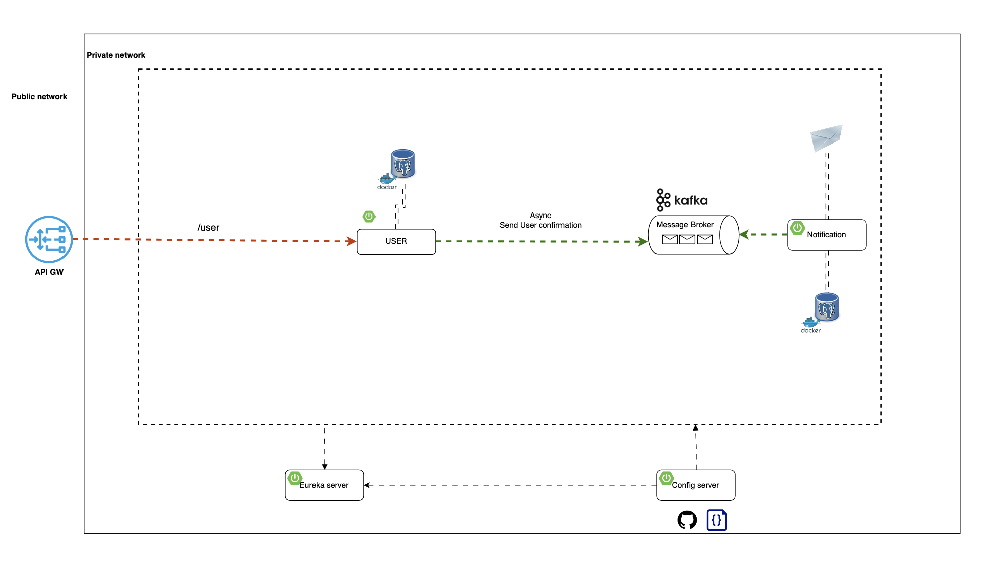

# JavaMailSender with Microservices

## Overview
**MailTestWithMicroservices** is a microservices-based project designed to test email sending functionality using **Kafka** and **Spring Boot**. The project follows **Domain-Driven Design (DDD)** and **Event-Driven Design** principles to ensure a scalable and maintainable architecture. It utilizes event-driven communication to handle email notifications efficiently.
## Architecture
The project follows a **microservices architecture** with the following key services:

- **Config Service**: Centralized configuration management for all services.
- **Discovery Service**: Service registry for dynamic service discovery.
- **API Gateway**: Acts as the entry point for all incoming requests and routes them to respective microservices.
- **User Service**: Handles user-related operations, including registration and authentication.
- **Notification Service**: Listens for Kafka events and sends email notifications accordingly.

Each service is independent and communicates asynchronously using **Kafka**.

## Technologies Used
- **Spring Boot 3.4.2** - Backend framework for microservices.
- **Spring Cloud** - Provides distributed system support.
- **Kafka** - Message broker for asynchronous communication.
- **PostgreSQL** - Database for storing user data.
- **Spring Security & JWT** - Authentication and authorization.
- **Docker** - Containerization of services.
- **Eureka** - Service discovery.
- **Spring Cloud Config** - Centralized configuration management.

## How It Works
1. **User Registration/Login**
    - The User Service receives user registration or login requests.
    - It generates a verification code (for email confirmation) and publishes an event to Kafka.
    - The event contains user details and a verification code.

2. **Kafka Event Processing**
    - The Notification Service listens to the Kafka topic for user-related events.
    - Upon receiving a user verification event, it processes the data and sends an email using **Spring Mail** and **Thymeleaf Templates**.

3. **Email Notification**
    - The Notification Service fetches the email template and dynamically fills it with user-specific data.
    - The email is sent to the user's email address.
    - The system logs the sent email for debugging purposes.

## Services
Each service has its own dedicated README for detailed information:

- [**Config Service**](./services/config-server/README.md)
- [**Discovery Service**](./services/discovery/README.md)
- [**API Gateway**](./services/gateway/README.md)
- [**User Service**](./services/user-service/README.md)
- [**Notification Service**](./services/notification/README.md)




## Running the Project
### Prerequisites
- **Java 21**
- **Maven**
- **Docker**
- **Kafka & Zookeeper**

### Steps
1. Clone the repository:
   ```sh
   git clone https://github.com/your-org/MailTestWithMicroservices.git
   cd MailTestWithMicroservices
   ```
2. Start Kafka and Zookeeper:
   ```sh
   docker-compose up -d
   ```
3. Build and start services:
   ```sh
   mvn clean package
   docker-compose up --build
   ```

## Example Kafka Log
```
2025-02-11T15:02:13.083+03:00  INFO 15913 --- [user-service] [nio-8070-exec-4] c.f.mailsender.kafka.UserProducer        : Sending confirmation: UserConfirmation(userId=65045ce9-4b54-4389-b574-d935b9b02fdb, email=johndo3e@ex34ample2.com, verificationCode=cd943fe27c, verificationCodeExpiration=2025-02-11T15:07:13.059396, userLoginTime=null)
```

## Example JSON Payload
```json
{
  "userId": "65045ce9-4b54-4389-b574-d935b9b02fdb",
  "email": "johndo3e@ex34ample2.com",
  "verificationCode": "cd943fe27c",
  "verificationCodeExpiration": "2025-02-11T15:07:13.059396",
  "userLoginTime": null
}
```

## Monitoring & Debugging
To monitor the services, you can check logs using:
```sh
docker logs -f <container_name>
```
Or for Kafka topics:
```sh
docker exec -it kafka kafka-console-consumer.sh --bootstrap-server kafka:9092 --topic user-verifications --from-beginning
```

## Contributions
Feel free to fork and contribute to this project! Create a pull request if you find any issues or want to add features.

## License
This project is licensed under the **MIT License**.

